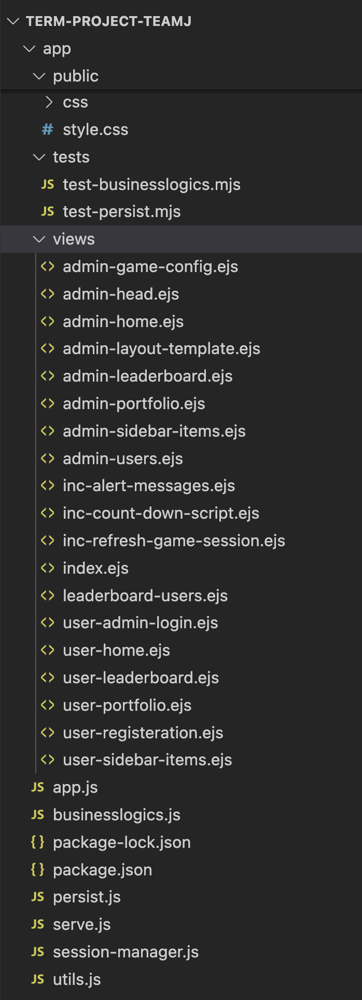
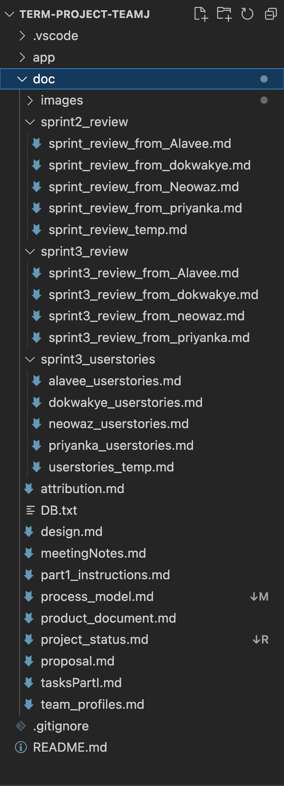

# Directory Structure

## `TERM-PROJECT-TEAMJ`
The root folder of the project, containing all main project files and directories.

---

## `app`
The `app` folder holds the core application code and dependencies. It includes a subfolder and several main JavaScript files.

- To run the application: open your terminal, change the directory into the app folder with `cd app` folder and then run
```
    npm install
    node server.js
```
## Unit test instruction 

We have two unit tests for the project. To run these unit tests use the below commands (on `app` directory)
```
npm -test /tests/test-businesslogics.mjs
npm -test /tests/test-persist.mjs
```
---
### Subfolders in `app`:

## `public`
This folder stores public assets like CSS files, JavaScript files, and images that are directly accessible from the client side.

### Subfolders in `public`:
- **`css`**: Contains stylesheets (`.css` files) used to style the web pages.
- **`style.css`**: A primary stylesheet for the project.

---

## `tests`
The `tests` folder contains test files to ensure the core logic and functionality of the application work as expected.

### Files in `tests`:
- **`test-businesslogics.mjs`**: Script for testing backend business logic functions.
- **`test-persist.mjs`**: Script for testing persistence functionality, such as database storage.

---

## `views`
The `views` folder contains `.ejs` files, which are templates for rendering dynamic HTML content. These templates allow embedding JavaScript to display backend data.

### Files in `views`:
- **`admin-game-config.ejs`**: Serves the game configuration page for the admin.
- **`admin-head.ejs`**: Contains the `<head>` section for admin pages.
- **`admin-home.ejs`**: Landing page for administrators after login.
- **`admin-layout-template.ejs`**: Layout template for admin pages.
- **`admin-leaderboard.ejs`**: Displays the leaderboard for admin users.
- **`admin-portfolio.ejs`**: Displays admin portfolio details.
- **`admin-sidebar-items.ejs`**: Sidebar navigation items for admin pages.
- **`admin-users.ejs`**: Page for managing admin users.
- **`inc-alert-messages.ejs`**: Embedded script for displaying alert messages.
- **`inc-count-down-script.ejs`**: Countdown script for games/events.
- **`inc-refresh-game-session.ejs`**: Script for refreshing game sessions dynamically.
- **`index.ejs`**: Main entry point or home page of the application.
- **`leaderboard-users.ejs`**: Displays rankings, scores, and achievements for users.
- **`user-admin-login.ejs`**: Login page for administrators.
- **`user-home.ejs`**: Main landing page for regular users after login.
- **`user-leaderboard.ejs`**: Displays the leaderboard for regular users.
- **`user-portfolio.ejs`**: Displays portfolio details for regular users.
- **`user-registration.ejs`**: Registration page for new users.
- **`user-sidebar-items.ejs`**: Sidebar navigation items for user pages.

---
## JavaScript Files
The following JavaScript files are located in the `app` folder and handle various backend and frontend operations:

- **`app.js`**: Main application file that sets up the server and configures the app.
- **`businesslogics.js`**: Contains core business logic functions for the backend.
- **`persist.js`**: Manages data persistence, such as database interactions and storage operations.
- **`serve.js`**: Configures and starts the server, setting up routes and middleware.
- **`session-manager.js`**: Manages user sessions, handling login authentication and session data.
- **`utils.js`**: A collection of utility functions used across different parts of the application.
- **`validate-fields.js`**: Handles validation of form inputs to ensure data integrity.

### Package Files
- **`package.json`**: Lists project dependencies, scripts, and metadata for the Node.js application.
- **`package-lock.json`**: Automatically generated file that locks the dependencies for consistent installation.

---
## Documentation (`doc` folder)

This folder contains all project documentation, providing details about the project structure, process, and progress.

### Subfolders in `doc`:
- **`images`**: Contains visual assets such as diagrams and screenshots for documentation purposes.
- **`sprint2_review`**: Contains end-of-sprint review documents from Sprint 2.
- **`sprint3_review`**: Contains end-of-sprint review documents from Sprint 3.
- **`sprint3_userstories`**: User stories for Sprint 3, describing future features and functionality requirements.

### Files in `doc`:
### Files in `doc`:
- **`DB.txt`**: Contains database structure and schema details.
- **`Directories_03.png`**: Diagram representing folder structures or workflows.
- **`attribution.md`**: List of sources and references used in the project.
- **`design.md`**: Contains design-related information, such as architecture and diagrams.
- **`meetingNotes.md`**: Records of team meetings, agendas, and decisions made.
- **`part1_instructions.md`**: Instructions and requirements for Part 1 of the project.
- **`process_model.md`**: Describes the process model followed in the project.
- **`product_document.md`**: Detailed documentation of the project’s features and development process.
- **`project_status_Sprint02.md`**: Detailed status report for Sprint 2, including completed tasks and progress.
- **`proposal.md`**: The initial project proposal and objectives.
- **`tasksPart1.md`**: Lists tasks completed in Part 1 of the project.
- **`team_profiles.md`**: Profile information of all team members, including roles and skills.


---

### Visual Assets in `images`:
- **`Admin_dashboard.png`**: Screenshot of the admin dashboard.
- **`Directories_02.jpg`**: Folder structure diagram in JPEG format.
- **`Directories_02.png`**: Folder structure diagram in PNG format.
- **`folder_image.PNG`**: Additional image representing folders.
- **`Login.png`**: Screenshot of the login page.
- **`Player_dashboard.png`**: Screenshot of the player dashboard.
- **`Process.png`**: Diagram showcasing the project process.
- **`somerville2_3.svg`**: SVG file for Somerville process model visualization.
- **`TeamJ_Web_Architecture.svg`**: Web architecture diagram for the project.





---
## Product Demonstration

- Video demo of the app: [Watch Here](https://www.loom.com/share/3c223b9f8c5b4f7299f864fafd8efc34)


---

### Completed Features

- **Admin Login**: Admin credentials are provided (Email: `teamj-admin@mun.ca`, Password: `123456`).
- **Admin Dashboard**: Features include User Details, Game Session Details, graphical views, etc.
- **User Dashboard**: Landing and Trade
- **Game Configuration** and Countdown Timer.
- **Player Registration** and **Player Dashboard**.
- **Fetch Stock Prices** from last trade API.
- **Buy** and **Sell Stock** functionality.
- **leader board** and **Update stock price based on hytorical data** functionality.


### Recent Updates

- Updated `attribution.md` with new sources for all members.
- `meetingNotes.md` contains the latest meeting records.
- `project_document.md` provides details on sprint outcomes.
- `sprint3_review` includes the end-of-sprint review from all of our team members.
- `sprint3_userstories` includes the feature suggestion for future implementation from all of our team members.
-  We have updated our architecture in `design.md`
-  `process_model.md ` contains the updated process model
- Tasks from Sprint 3 are labeled accordingly on the Kanban board.

  
