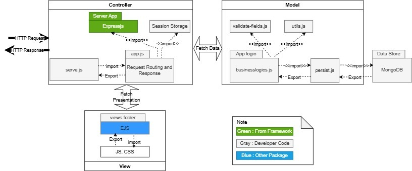
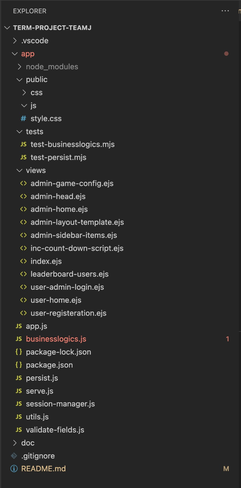

# **Project Architecture Documentation**

## **Overview**
This document provides a detailed outline of the project architecture, designed following the Model-View-Controller (MVC) design pattern. The architecture prioritizes scalability, maintainability, and a clear separation of concerns to facilitate efficient development and future enhancements.

---

## **Architecture Diagram**

---

## **MVC Structure**

### **1. Model**
- **Purpose:** Responsible for handling the core business logic, data validation, and interactions with the database.
- **Key Files:**
  - `validate-fields.js`: Ensures user input meets defined criteria.
  - `utils.js`: Offers reusable utility functions for common tasks.
  - `businesslogics.js`: Encapsulates core business rules and calculations.
  - `persist.js`: Interfaces with MongoDB for data persistence.
- **Data Storage:** MongoDB serves as the primary database for this project.
- **Interfaces:** 
  - Provides functions for validation, business logic execution, and data persistence, utilized by the Controller.

---

### **2. View**
- **Purpose:** Handles the presentation layer, focusing on delivering a dynamic user interface.
- **Key Files:**
  - `views/`: Directory containing EJS (Embedded JavaScript) templates for rendering dynamic HTML.
  - `public/`: Stores static assets like JavaScript files, CSS stylesheets, and images.
- **Interfaces:**
  - Renders dynamic content passed from the Controller through EJS templates.

---

### **3. Controller**
- **Purpose:** Manages HTTP requests, application routing, and session handling.
- **Key Files:**
  - `serve.js`: Entry point for initializing the server.
  - `app.js`: Configures application routing and middleware.
- **Framework:** Express.js is used for routing and request/response management.
- **Session Management:** Utilizes session storage for maintaining user sessions.
- **Interfaces:**
  - Bridges the Model and View by:
    - Fetching data from the Model.
    - Passing processed data to the View for rendering.

---

## **Interfaces and Communication Flow**
1. **HTTP Request/Response Flow:**
   - HTTP requests are captured by the Controller.
   - The Model processes the necessary data operations.
   - The Controller sends processed data to the View for rendering a response.

2. **Model-Controller Interaction:**
   - The Controller imports Model functions to execute database operations and implement business logic.

3. **Controller-View Interaction:**
   - The Controller passes prepared data to the View for rendering the user interface.

---

## **Interfaces for persist.js**
- Functions available for data manipulation and retrieval:
  - `initStore`: Initializes the database connection.
  - `closeStore`: Closes the database connection.
  - `getUserByEmail`: Fetches user details using email.
  - `createNewUser`: Creates a new user in the database.
  - `getGameConfig`: Retrieves game configuration details.
  - `getLeaders`: Fetches leaderboard information.
  - `setGameConfig`: Updates game configuration settings.
  - `startGameSession`: Initializes a new game session.
  - `findLeaderBoard`: Searches for leaderboard data.
  - `joinGameSession`: Adds a user to an active game session.
  - `getUserGameStatus`: Retrieves a user's game session status.
  - `getStocks`: Fetches available stock information.
  - `setStock`: Adds or updates stock data.
  - `updateUserOnLeaderboard`: Modifies user data on the leaderboard.
  - `removeStock`: Deletes stock data.
  - `getActiveGameSession`: Retrieves details of an active game session.
  - `updateStockPrices`: Updates stock price information.
  - `endGameSession`: Ends an active game session.
  - `getUsers`: Fetches a list of users.
  - `buyStock`: Processes stock purchases.
  - `sellStock`: Handles stock sales.
  - `fetchGameParticipants`: Retrieves participants in a game session.

---

## **Conclusion**
This architecture leverages the MVC design pattern to achieve a clean separation of concerns, ensuring modularity, maintainability, and scalability for ongoing and future development efforts.

---

## **File Structure**

