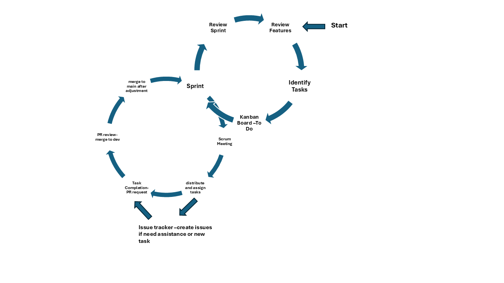

# Overview

Our team follows an iterative and flexible development process, leveraging continuous flow sprints rather than strict time-boxed iterations. Tasks are divided at the start of each sprint and as new ideas emerge during development. This allows us to adapt to changes dynamically and ensures that we deliver increments consistently by the sprint's final pull request deadline.

# Reference Diagram

Our sprint-based process involves collaboration among all team members, regular assessment of progress, and flexibility to adapt based on feedback. The figure below provides an overview of our process model.

---

We use GitHub's Kanban board to visualize our workflow. Tasks move from **To Do** to **In Progress** and then to **Done**, representing the various sprint phases.

### Kanban Board

The **Kanban board** mirrors the Scrum elements as follows:

- **Project Backlog**: Corresponds to the Scrum Product Backlog, listing all future tasks.
- **To Do**: Reflects the Sprint Backlog, showing tasks ready for the current sprint.
- **In Progress**: Aligns with the Develop Software phase, tracking active tasks.
- **Done**: Represents the Shippable Product Increment, indicating completed and tested tasks.
- **Retrospective**: Supports the Review Sprint, capturing lessons learned and areas for improvement.

**Labels**: Tasks are tagged with sprint names for easier identification.  
**Assignments**: Team members are assigned tasks directly on the board.

We address **blocked tasks** during Scrum meetings. If necessary, we log an issue in the project tracker and involve other team members for assistance.

This setup helps visualize progress and manage sprint tasks efficiently.

---

### Team Collaboration

1. **Sprint Planning and Task Assignment**:  
   Tasks are prioritized and assigned based on team members' expertise and contributions during discussions. Collaboration ensures the right person is assigned the most suitable task.
   
2. **SCRUM Roles**:  
   Scrum Master and Note-Taker roles rotate among all team members. This allows everyone to share responsibilities and contribute to team management.

3. **Communication Tools**:  
   - Primary communication takes place on **Microsoft Teams**.
   - Additional discussions or decisions are handled during group huddles or class meetings.

---

### SCRUM Meetings

- **SCRUM meetings** foster collaboration and transparency, ensuring sprint success.  
   Each meeting keeps the team aligned and helps address blockers early.

- **Sprint Planning** defines the goals and scope of the sprint, providing direction.  
- **Standups, Sprint Planning, Sprint Review, and Retrospective Meetings**:  
   Held after class or when all members are available.

- **Agendas**:  
   - *Standing Agenda*: Regular updates on task progress, issues, and blockers.  
   - *Specific Agenda*: Tailored to address unique challenges or focus on particular aspects of the sprint.

---

### Documentation

- Meeting minutes are documented by the Note-Taker and stored in the **`doc` folder** within the repository.  
- If the Note-Taker is unavailable to push the notes, another team member assists.

These practices ensure smooth progress and adaptation throughout the sprint cycle.

---

### Source Control Strategy

1. **Source Control**:  
   - Each task is developed on a **dedicated branch**.  
   - Upon task completion, a pull request is created for the **development branch** for the current sprint.  
   - A designated **Code Reviewer** evaluates and merges the pull request into the main branch.

2. **Testing**:  
   - We write **test cases for APIs** to ensure they meet user and project requirements.  
   - Test cases are tracked on the **Kanban board** or issue tracker to ensure visibility.

---

### Issue Tracker

Our **GitHub issue tracker** complements the Kanban board by addressing unforeseen challenges and roadblocks during the development process. Here's how we utilize it:

- **Blockers**:  
   Team members encountering difficulties with their assigned tasks, such as bugs or implementation challenges, log these as **issues** in the tracker.  

- **New Addressable Items**:  
   If a new priority or task arises that doesn't fit directly into the sprint plan, it is logged as an issue.  

- **Feature and Task Tracking**:  
   Features and tasks are primarily managed on the **Kanban board**. The issue tracker comes into play when a specific **bug**, **improvement**, or **additional requirement** needs to be addressed.  

- **Collaborative Resolution**:  
   Logged issues are reviewed during **SCRUM meetings**, where team members collaborate to resolve them or adjust the sprint plan.

By treating the issue tracker as a dynamic tool for managing blockers and unexpected tasks, we ensure flexibility and adaptability in our workflow while keeping the **Kanban board** as the primary system for tracking planned tasks and progress.

---

### Pull Request/ Code Review Process

Our pull request (PR) review process ensures efficient task completion and code quality:

1. **Branching**:  
   Each task is developed on a dedicated branch, named after the specific task or feature being worked on.

2. **PR Creation**:  
   Once a task is completed, it is submitted as a PR to the sprint's development branch for integration.

3. **Code Review**:  
   A designated reviewer examines the functionality, task implementation, and adherence to coding standards.

4. **Feedback**:  
   If changes are needed, the reviewer provides detailed feedback for the developer to address.

5. **Approval and Merge**:  
   After approval, the PR is merged into the development branch. At the end of the sprint, the development branch is merged into the main branch to finalize the integration.

This structured process ensures code quality, collaborative progress, and smooth project development.

---

### Other Tools and Techniques

In addition to GitHub and the issue tracker, the team utilizes the following tools and methods to enhance collaboration and align with Scrum practices:

1. **In-Person and Online Meetings**:  
   - **Relation to Scrum**:  
      - The team primarily meets **in person after class**, ensuring direct and effective communication for **Sprint Planning**, **Sprint Retrospectives**, and **Standup meetings**.  
      - Occasionally, **Google Meet** is used for remote discussions when in-person meetings are not feasible.

2. **Communication Tools (e.g., WhatsApp)**:  
   - **Relation to Scrum**:  
      - **WhatsApp** serves as the team's primary tool for **daily communication**, quick updates, and coordination outside formal meetings.  
      - It facilitates ongoing discussions and ensures the team remains informed about blockers or updates.

3. **Documentation Tools (e.g., doc folder in repository)**:  
   - **Relation to Scrum**:  
      - All **sprint documentation**, including meeting notes, Sprint Backlogs, and review summaries, are stored in the **`doc` folder** in the GitHub repository.  
      - This centralized approach ensures that all members have easy access to critical documents and keeps the project organized and transparent.
