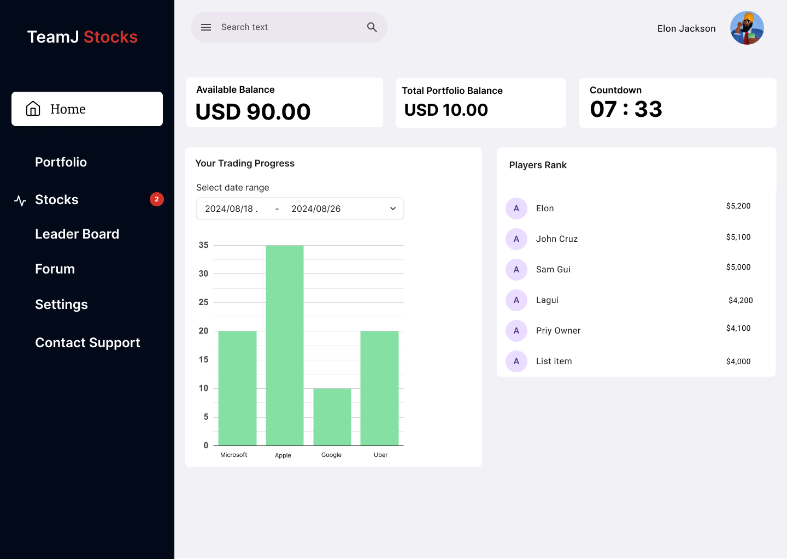
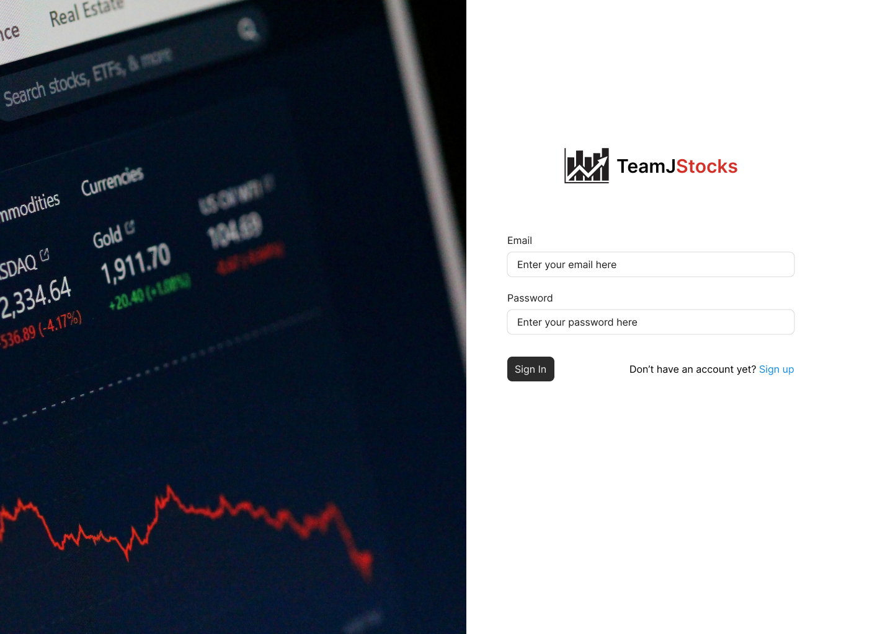
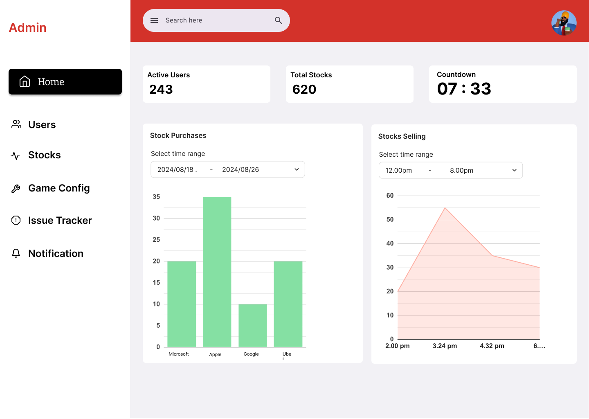

# Description

The stock trading simulation online application allows players to test their trading skills using real-time stock market data in an exciting and competitive atmosphere. Players are given a virtual startup amount upon registration, which they can use to purchase and sell stocks at current NYSE prices in order to expand their portfolio. In addition to viewing thorough trade histories and tracking the profitability of their portfolio, the players can also keep an eye on their placement on the leaderboard to see how they compare to other players. The platform offers a user-friendly, interactive interface together with real-time market trends and stock price updates. In addition, players can interact with game-specific regulations, personalize their profiles, and, depending on how the game is configured, access the portfolios of their rivals. At the end of the game, the player with the highest portfolio value is declared the winner, making every trading decision crucial for success. The exciting and strategic gameplay is maintained by the thrill of simulated trading, the possibility of in-game events, and the dynamic market environment.

## Player perspective

At the beginning of the game, all players will have an equal virtual account balance to be used for trading. Players will have the option to buy and sell (trade) stocks. The decision to trade any stock will greatly impact their account balance. Players will gain when their stock investments rise. Conversely, if their purchased stock value drops, they will incur losses. Players will have the option to sell an already purchased stock if they feel they will lose more. Additionally, players can buy more stocks that are performing well in the market. At the end of the game, the results of their decisions will reflect in their account balance. The player with the highest account balance will be declared the winner.

## Admin perspective

The administrator can start the game using the admin portal. While the game is running, the stock prices are automatically updated; however, the admin can trigger updates from time to time. If any technical issues are detected, the administrator can quickly address them to ensure the game runs smoothly. Essentially, the administrator ensures the game operates effectively within the given time frame.

# Screens

## Player Dashboard

# TeamJ Stocks Dashboard Overview

## Menu Items (Left Sidebar)
1. **Home**: Navigates to the main dashboard page, which displays the user's available balance, portfolio, trading progress, and ranking.
2. **Portfolio**: Allows users to view and manage their portfolio, including their current stocks and performance.
3. **Stocks**: Provides access to available stocks for trading. The red badge indicates 2 new items or notifications.
4. **Leader Board**: Displays the ranking of users based on their trading performance.
5. **Forum**: A community area where users can discuss trading strategies or other related topics.
6. **Settings**: Allows users to adjust their account settings, preferences, and other configurations.
7. **Contact Support**: Offers a way for users to get help or contact customer support.

## Top Bar Items
1. **Search Bar**: Allows users to search for specific stocks, users, or features.
2. **User Profile** (Elon Jackson): Displays the user’s profile and provides access to account settings, sign-out options, etc.

## Items on the Dashboard
1. **Available Balance** (USD 90.00): Shows the current available balance for trading.
2. **Total Portfolio Balance** (USD 10.00): Represents the total value of the user's portfolio.
3. **Countdown** (07:33): Possibly a countdown timer for trading sessions or upcoming events.
4. **Your Trading Progress**: A chart that visualizes the user's trading activity over a selected date range, with performance of specific stocks such as Microsoft, Apple, Google, and Uber.
5. **Players Rank**: Displays the ranking of players in terms of their portfolio value or trading performance, along with their respective amounts.

## Login

# TeamJ Stocks Login Page Overview

## Elements on the Login Page

1. **Logo and Branding**:
   - **TeamJ Stocks Logo**: The logo is displayed at the top of the login form to represent the application branding.

2. **Login Form**:
   - **Email Field**: A text input where the user can enter their email address.
   - **Password Field**: A text input where the user can enter their password.

3. **Sign In Button**:
   - **Sign In**: A button for submitting the login form. Upon clicking, the user's credentials are authenticated.

4. **Sign Up Link**:
   - **Sign Up**: A link for users who don't have an account yet. Clicking it takes them to the registration page to create a new account.

 ## Admin Portal GUI - Stock Trading Simulation Game 

  This admin portal provides various features for managing and monitoring 
  the stock trading simulation. Below is the description of each section of 
  the interface:

  1. Top Bar:
     - A search bar for admins to quickly search for information.
     - User profile icon on the top-right corner for managing admin settings.

  2. Sidebar Navigation (Left):
     - Home: Displays the main dashboard view with an overview of key statistics.
     - Users: Allows admins to manage registered players.
     - Stocks: Provides access to stock market information.
     - Game Config: Section to configure game settings like start time, duration, and player limits.
     - Issue Tracker: A tool for tracking and resolving any issues or bugs in the simulation.
     - Notification: Displays and configure important notifications related to the game.

  3. Main Dashboard (Center):
     - Active Users: Shows the number of currently active users in the game.
     - Total Stocks: Displays the total number of stocks available in the game simulation.
     - Countdown: A timer that shows the time left in the current game or simulation round.
     - Stocks Availability Chart: A bar chart showing stock availability for specific companies 
       (e.g., Microsoft, Apple, Google, Uber) within a selected date range.
     - Stocks Trend Chart: A line graph displaying the stock trends within a specific time frame, 
       showing stock activity and changes over the course of the day.

  Overall, the interface is designed for simplicity and ease of use, 
  providing admins with real-time data on game activity, stock availability, 
  and player behavior.

# Features

| ID | Name         | Access By | Short Description                                                       | Expected Implementation | Source of Idea                |
|----|--------------|-----------|------------------------------------------------------------------------|-------------------------|-------------------------------|
| 01 | Watchlist    | Player    | Players can add stocks to their watchlist                             | Likely to be done      | [Binance](https://www.binance.com/en) |
| 02 | Wallet       | Player    | Players can manage their virtual wallet                                | Likely to be done      | --                            |
| 03 | Automation   | Player    | Players can schedule automated buys or sells when stock prices hit a certain threshold | Likely to be done      |                               |
| 04 | Trade        | Player    | Players can manually buy and sell stocks                               | Must be implemented     |                               |
| 05 | Analysis     | Player    | Graphs representing the trading progress of each user                 | Must be implemented     |                               |
| 06 | Stocks       | Player    | Graphical representation of stock values over a given period          | Must be implemented     |                               |
| 07 | Password Reset| Player   | Forgot password functionality                                           | Likely to be done      |                               |
| 08 | News Feeds   | Player    | Simulated stock news functionality to influence players' decisions    | Likely to be done      |                               |
| 09 | Chat         | Player    | Chat feature for users to report issues and suggest improvements       | Likely to be done      |                               |
| 10|Real-Time Market Data Integration|Player|Incorporating real-time stock prices from actual markets so that players react to live market conditions|Must implement|https://app.wallstreetsurvivor.com/trading/equities|
| 11 |Pattern Recognition & Prediction Models | Player| Using machine learning to detect market patterns or predict stock trends, helping players anticipate market movements| Likely to be done|https://www.investopedia.com/how-to-use-artificial-intelligence-in-your-investing-7973810|
| 12|AI-Based Recommendations | Player| Leveraging artificial intelligence to analyze player portfolios and provide personalized trade recommendations based on historical data, market trends, and risk appetite.| Likely to be done|https://www.investopedia.com/how-to-use-artificial-intelligence-in-your-investing-7973810|
| 13|Player Collaboration & Challenges | Player| Allowing users to form teams or issue challenges to one another, fostering a sense of community and competition| Likely to be done|Followed by Clash Of Clans game|
| 14  | Starting Capital                             | Admin      | Admins can configure the initial capital players start within their portfolios.       | Must implement                  | Project instructions                                                                                            |
| 15  | Scheduling NYSE stock price                  | Admin      | Admins can configure real-time or simulated NYSE stock price updates.              | Must implement                  | Core gameplay feature                                                                                            |
| 16  | Introduce a bot for user support 24/7        | Admin      | Admins deploy a bot to provide 24/7 player support and assistance.                 | Possibly                        | Adds constant user support functionality                                                                         |
| 17  | Multi-level admin feature                    | Admin      | Admins can create different levels of admin access, such as super-admins.          | Likely to be done                | Necessary for role-based management                                                                              |
| 18  | Analytics/General dashboard                  | Admin      | Admins have access to a dashboard providing game analytics and performance metrics.| Likely to be done                | Important for high-level admin oversight and performance tracking                                                |
| 19  | Player Authentication & Profiles             | Admin      | Admins maintain player login and profile information, ensuring secure access.      | Must implement                  | Security and management functionality                                                                            |
| 20  | Authentication, login portal, notifications | Admin | Provides basic authentication, login, and notification system for players.         | Must implement                  | Core system functionality                                                                                         |
| 21  | Registration: Register players for the game  | Player    | Players can register for the stock trading simulation by creating an account.      | Must implement                  | Project instructions                                                                                            |
| 22  | Real-Time Trading: Buy and sell stocks       | Player    | Players can buy and sell stocks at live NYSE prices in real time.                  | Must implement                  | Stock trading platforms                                                                                          |
| 23  | Portfolio Tracker                            | Player    | Players can track their portfolio’s value and holdings in real-time.               | Must implement                  | Core feature for player progress                                                                                |
| 24  | Buy and sell stocks                          | Player    | Players can search for stocks and execute buy/sell trades.                         | Must implement                  | Core stock trading feature                                                                                       |
| 25  | Authentication, login portal, notifications | Player | Players can securely log in, receive notifications for trades, updates, and more.  | Must implement                  | Security and communication feature                                                                               |
| 26  | Social media trends to follow                | Player    | Players can access a feed of stock market-related trends from social media.        | Likely to be done                | Stock market platforms and trend tracking                                                                        |
| 27  | Game tutorials                               | Player    | Players can access tutorials on how to trade, manage portfolios, and understand the game. | Likely to be done                | New player onboarding and education                                                                              |
| 28  | Scoreboard: Live player rankings             | Player    | A live leaderboard displays players and their portfolio values in real-time.       | Must implement                  | Common feature in competitive games   
| 29  | Create and manage games                      | Admin     | Admins can create and configure new game sessions, including start/end dates.      | Must implement                  | Core admin feature                                                                                               |
| 30  | Create and manage users/players              | Admin     | Admins can add, edit, or remove users, assign roles, and manage player accounts.   | Must implement                  | Project instructions                                                                                            |
| 31  | Real-time game monitoring                    | Admin     | Admins can monitor all game activities and player actions in real-time.            | Must implement                  | Common in game and competition platforms                                                                         |
| 32  | Pause or End Game Sessions                   | Admin     | Admins can pause or prematurely end game sessions when needed.                     | Likely to be done                | Control over game management                                                                                     |
| 33  | Player Activity Logs and Reports             | Admin     | Admins can view detailed logs of player activity and generate reports.             | Must implement                  | Essential for auditing and player performance tracking                                                           |
| 34  | Send Announcements or Alerts                 | Admin     | Admins can send notifications or alerts to all players regarding game updates.     | Likely to be done                | Common feature in large multiplayer platforms                                                                    |
| 35  | Access Control and Security Management       | Admin     | Admins manage authentication, reset passwords, and oversee account security.       | Must implement                  | Core security feature                                                                                            |
| 36  | Currency Conversion                          | Player    | Players can view their portfolio values in different currencies, depending on their country. | Likely to be done                | Global platforms with international user base                                                                    |
| 37  | Achievement Badges                           | Player    | Players can earn badges for milestones like "First Trade" or "Portfolio Doubled".  | Likely to be done                | Gamification for player engagement                                                                               |
| 38  | Global Chat or Forum                         | Player    | Players can discuss strategies and market trends in a live chat or forum.          | Likely to be done                | Multiplayer and community-building features                                                                      |
| 39  | Transaction History                          | Player    | Players can view a detailed history of all their trades and transactions.          | Must implement                  | Record of player activity and performance tracking                                                               |

